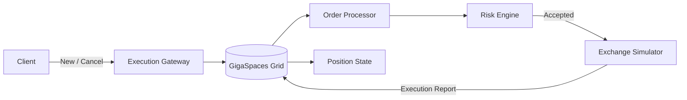

# trading-execution-lab

[简体中文](README.zh-CN.md)

A hands-on Java trading execution system lab for learning stateful, low-latency trading architecture with GigaSpaces, FIX, risk controls, failure recovery, and production-oriented design.

**Build target:** Java 25 (Maven Compiler Plugin 3.15.0).

Stages 1–4 have core teaching implementations: the order domain, embedded Space, synthetic routing comparison, in-memory OrderBook, and synchronous order command/event flow. Stage 5 (concurrency, ordering, and idempotency) is next and has not started. Real multi-partition benchmarks, durable event processing, and the full service architecture remain future work. See the [Grid module](gigaspaces-grid/README.md), [Stage 3 walkthrough](docs/stage3-routing.zh-CN.md), [Stage 4 walkthrough](docs/stage4-order-events.zh-CN.md), and [OrderBook data-structure walkthrough](docs/order-book-walkthrough.zh-CN.md).

> Goal: build enough practical trading-system depth to discuss and implement order lifecycle, execution state, partitioning, high availability, failure recovery, and FIX connectivity in a realistic Java system.

## Learning Roadmap

### Phase 1 — Domain & Order State
- Model `Order`, `Execution`, `Position`, `Account`, `RiskLimit`
- Implement the minimal order lifecycle:
  - NEW
  - ACKNOWLEDGED
  - PARTIALLY_FILLED
  - FILLED
  - REJECTED
  - CANCELLED
- Deliverable: an in-memory order state model

### Phase 2 — GigaSpaces Space

- Store an order snapshot in an embedded Space
- Learn write / read / take / change, identity, and routing
- Deliverable: the [Space lesson](docs/space-lesson.zh-CN.md), verified locally by the project user

### Phase 3 — Partitioning, Routing & Data Affinity
- Learn partitions and routing keys
- Compare routing by `orderId`, `clientId`, and `symbol`
- Understand colocating orders, positions, and risk state
- Deliverable: a deterministic synthetic comparison and documented trade-offs (implemented); real clustered latency benchmark remains future work

### Phase 4 — Order Event Processing
- Introduce order commands and execution events
- The exchange module has a single-symbol in-memory OrderBook and synchronous command/event processor
- Learn polling / notify containers and FIFO concerns
- Model:
  - NewOrder
  - CancelOrder
  - ExecutionReport
- Deliverable: tested in-memory order processing flow (implemented); durable event containers remain future work

### Phase 5 — Concurrency & Ordering
- Optimistic locking / versioning
- Idempotency and duplicate event handling
- Out-of-order Execution Reports
- Deterministic state transitions
- Deliverable: concurrency and ordering test cases

### Phase 6 — Primary / Backup & Failover
- Primary-backup replication
- Synchronous replication
- Failover and promotion
- In-flight request behaviour
- Deliverable: kill-primary failure experiment

### Phase 7 — Recovery & Persistence
- Recovery after process / node failure
- Network partition scenarios
- Split-brain risks
- Duplicate execution prevention
- Deliverable: failure matrix and recovery strategy

#### Persistence & Mirror
- Persist in-memory state to PostgreSQL
- Learn Mirror / async persistence concepts
- Define source-of-truth and recovery boundaries
- Deliverable: persistence and restart recovery

### Phase 8 — Mini Execution Service
Build the end-to-end execution flow:



- Deliverable: working mini execution service

### Phase 9 — QuickFIX/J Integration
- FIX session basics
- NewOrderSingle (35=D)
- ExecutionReport (35=8)
- OrderCancelRequest (35=F)
- Sequence numbers, resend, duplicate handling
- Deliverable: FIX-enabled gateway

### Phase 10 — Trading System Interview
- Explain architectural trade-offs
- Walk through failure scenarios
- Discuss latency vs consistency vs availability
- Compare GigaSpaces with Redis / Hazelcast / Coherence
- Deliverable: interview-ready system design walkthrough

## Planned Modules

```text
trading-execution-lab/
├── order-domain/
├── execution-gateway/
├── gigaspaces-grid/
├── risk-engine/
├── exchange-simulator/
├── persistence/
├── failure-tests/
└── docs/
```

## Engineering Principles

This project intentionally focuses on trading-system concerns instead of CRUD application patterns:

- explicit order state transitions
- strict ordering where required
- deterministic processing
- idempotency
- low-latency state access
- data affinity
- failure recovery
- observability
- realistic fault injection

## Current Status

- [x] Repository initialized
- [x] Learning roadmap defined
- [x] Maven multi-module skeleton created
- [x] Phase 1: order domain model
- [x] Phase 1: order state machine
- [x] Phase 2: GigaSpaces local Space lesson and runtime verification
- [x] Phase 3: synthetic partitioning / routing model (real cluster benchmark pending)
- [x] Phase 4A: deterministic top-of-book simulator and in-memory OrderBook
- [x] Phase 4: synchronous order command and event processing
- [ ] Phase 5: concurrency / ordering
- [ ] Phase 6: primary / backup failover
- [ ] Phase 7: recovery / persistence
- [ ] Phase 8: mini execution service
- [ ] Phase 9: QuickFIX/J
- [ ] Phase 10: interview walkthrough

## How We Will Work

Each learning step should produce:

1. one concrete concept learned;
2. one piece of Java implementation;
3. one failure scenario;
4. one interview question;
5. one visible Git commit.

The intention is to grow this repository incrementally rather than generate the whole system at once.
