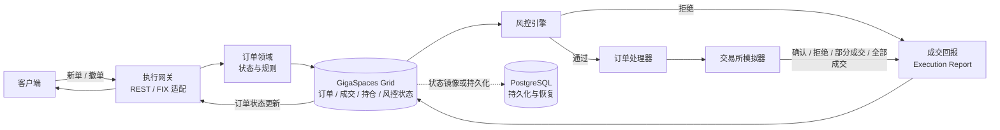
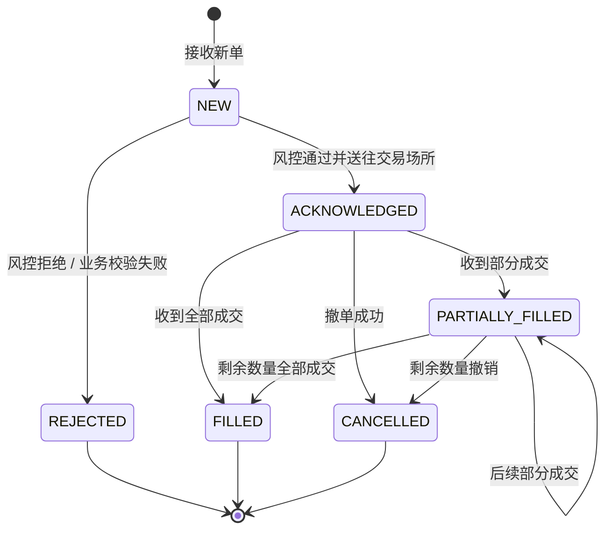

# Trading Execution Lab

[English](README.md) | 简体中文

这是一个用 Java 逐步搭建的交易执行系统学习项目，围绕订单生命周期、低延迟状态管理、风险检查、事件处理、高可用与故障恢复展开。项目计划结合 GigaSpaces、FIX 和 PostgreSQL，练习交易系统与分布式系统中的关键设计问题。

> **当前进度：Stage 1–4 的核心教学实现已完成。** 包括订单状态流转、本地 Space 读写、合成分区路由分析、单进程内存版 OrderBook，以及同步订单命令 / 事件流程。真实多分区集群、事件容器、并发、高可用与故障恢复仍是后续学习目标。详见[学习路线图](docs/learning-roadmap.zh-CN.md)。

## 项目希望解决的问题

- 如何定义订单状态及合法的状态流转？
- 如何处理重复、乱序到达的成交回报？
- 如何按业务键分区，并让订单、持仓和风控状态就近访问？
- 主备切换、节点故障和网络分区时，如何恢复状态并避免重复执行？
- 如何在内存状态、持久化存储与外部交易场所之间划定职责？

## 目标架构

下面展示计划中的端到端订单处理路径：网关接收订单，领域与风控逻辑处理请求，交易所模拟器返回回报，状态最终异步或按既定策略持久化。

## 订单生命周期（目标行为）

订单状态机将作为后续领域模型的核心。实际允许的迁移规则会在实现阶段通过领域约束和测试明确。

## Maven 模块

| 模块 | 计划职责 | 当前情况 |
| --- | --- | --- |
| `order-domain` | 订单、成交、持仓和领域状态流转 | 已实现基础模型与状态规则 |
| `execution-gateway` | 接收外部订单命令，后续承载 REST / FIX 适配 | 仅有 Maven 配置 |
| `gigaspaces-grid` | Space 配置、路由、分区与事件处理集成 | 本地 Space 读写与合成路由分布实验已实现；真实集群压测待后续 |
| `risk-engine` | 下单前风控检查及风险状态 | 仅有 Maven 配置 |
| `exchange-simulator` | 行情快照模拟、OrderBook 和撮合结果 | 已实现快照模拟、单证券内存版 OrderBook 与同步订单命令 / 事件处理 |
| `persistence` | PostgreSQL 持久化与重启恢复 | 仅有 Maven 配置 |
| `failure-tests` | 故障切换、重复消息、乱序和恢复场景 | 测试依赖待后续阶段引入 |

## 学习路线

1. 建立订单领域模型和确定性状态机。
2. 学习 GigaSpaces Space 的读写、对象身份和路由。
3. 比较按 `orderId`、`clientId` 和 `symbol` 分区的取舍。
4. 引入新单、撤单和成交回报事件，明确处理顺序。
5. 加入版本控制、幂等键和重复事件抑制。
6. 实验主备切换、节点故障及网络中断。
7. 接入 PostgreSQL，定义恢复边界和状态来源。
8. 组装迷你执行服务，再逐步加入 QuickFIX/J。
9. 整理架构取舍与故障场景，形成系统设计讲解。

完整路线和每阶段的概念、实现与退出条件见[中文学习路线图](docs/learning-roadmap.zh-CN.md)；原始英文版见[Learning Roadmap](docs/learning-roadmap.md)。架构职责和依赖原则见[架构说明](docs/architecture.md)。

后续交给 DeepSeek 的分步任务、约束与人工验收场景见[实现指导](docs/implementation-guide.zh-CN.md)。

已实现经典 OrderBook（中央限价订单簿）的单证券内存版，支持价格 / 时间优先撮合和撤单。设计范围、数据结构、匹配流程、状态边界和测试拆分见[OrderBook 设计说明](docs/order-book-design.zh-CN.md)。

## GigaSpaces 官方资料

- [GigaSpaces 技术文档首页](https://docs.gigaspaces.com/latest/landing.html)：产品、架构、指南和参考实现入口。
- [Getting Started](https://docs.gigaspaces.com/latest/started/dev-guide-getting-started.html)：开发环境与入门指南。
- [Space 与基础术语](https://docs.gigaspaces.com/latest/overview/terminology.html)：Space、读写操作和平台核心概念。
- [API 文档索引](https://docs.gigaspaces.com/latest/api-docs/api-docs-version.html)：Java API 与相关参考资料。

## 开始使用

项目使用 Maven 多模块结构，编译目标为 Java 25。请使用 JDK 25 运行 Maven，按[阶段 2 操作说明](docs/space-lesson.zh-CN.md)启动 `SpaceLesson`，观察订单写入、查询、更新和取走。

## 工程原则

- 领域模型不直接依赖 GigaSpaces、FIX 或数据库实现。
- 订单状态迁移应明确、可验证且具有确定性。
- 对成交回报考虑幂等、重复投递和乱序到达。
- 讨论分区、可用性、持久化与一致性时，结合可复现的故障场景。
- 按学习阶段逐步实现，不把规划中的能力描述为已完成能力。

## 当前进度

- [x] 仓库初始化
- [x] Maven 多模块骨架
- [x] 学习路线与目标架构文档
- [x] 订单领域模型与状态机
- [x] GigaSpaces 本地 Space 读写实验并完成本地验证
- [x] Stage 3：合成分区路由 / 数据亲和性实验（真实多分区性能实验待做）
- [x] 事件处理预备练习：确定性交易所模拟器
- [x] 单证券内存 OrderBook：价格优先、同价 FIFO、多档撮合和撤单
- [x] Stage 4：同步订单命令与事件流程
- [ ] 并发、顺序与持久幂等
- [ ] 主备、故障恢复与持久化
- [ ] 迷你执行服务与 FIX 集成

Stage 3 与 Stage 4 的实现、边界、验收方式、自测和面试表达见[Stage 3 路由说明](docs/stage3-routing.zh-CN.md)及[Stage 4 订单事件说明](docs/stage4-order-events.zh-CN.md)。每个学习步骤计划产出概念说明、Java 实现、故障场景和面试问题，并通过 Git 提交记录演进过程。
