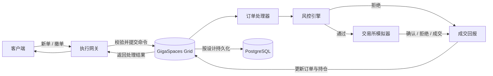

# 目标架构

本文记录项目计划演进到的系统形态。当前仓库只有 Maven 多模块骨架，以下组件和交互仍属于设计目标。

## 端到端订单流程

订单、成交、持仓和风控状态计划放在同一数据网格中，并通过路由键控制数据所在分区。具体路由策略尚未决定，需要结合订单聚合、风控检查的访问模式和故障恢复要求进行比较。

## 模块职责

| 模块 | 职责 |
| --- | --- |
| `order-domain` | 纯交易领域模型和业务规则；首版不依赖基础设施 |
| `execution-gateway` | 外部订单命令入口，后续可承载 REST 和 FIX 适配器 |
| `gigaspaces-grid` | GigaSpaces 配置、数据对象、路由分区和事件处理集成；参考 [官方开发文档](https://docs.gigaspaces.com/latest/landing.html) |
| `risk-engine` | 下单前检查和风险状态管理 |
| `exchange-simulator` | 模拟交易场所确认、拒绝、部分成交与全部成交 |
| `persistence` | 数据库持久化、状态重建和重启恢复 |
| `failure-tests` | 故障切换、重复消息、乱序处理和恢复实验 |

## 依赖方向

领域层表达交易规则；应用层编排用例；基础设施层接入 GigaSpaces、FIX 和 PostgreSQL。依赖从外向内，核心领域不应直接依赖具体中间件。

## 设计关注点

- **状态迁移：** 明确每个订单状态允许的后继状态，拒绝无效迁移。
- **幂等处理：** 用稳定的成交标识抑制重复回报，避免重复更新订单和持仓。
- **事件顺序：** 考虑并发更新、乱序回报和版本冲突，确保处理结果可解释。
- **数据亲和性：** 比较按 `orderId`、`clientId` 或 `symbol` 路由的访问成本与一致性影响。
- **故障恢复：** 定义主备切换、持久化滞后、状态重建和网络分区期间的行为。
- **可观测性：** 记录命令、状态变更、风险决策和执行回报之间的关联信息。

## 关键取舍待实验验证

1. 订单与持仓按什么键路由，才能减少跨分区访问？
2. 主备复制、持久化和外部回报之间采用怎样的确认边界？
3. 节点切换或网络中断后，如何确定唯一有效的处理者？
4. GigaSpaces 中的状态与 PostgreSQL 中的记录分别承担什么恢复职责？

这些问题会随着各阶段的实现和故障实验逐步收敛，当前不预设具体答案。
