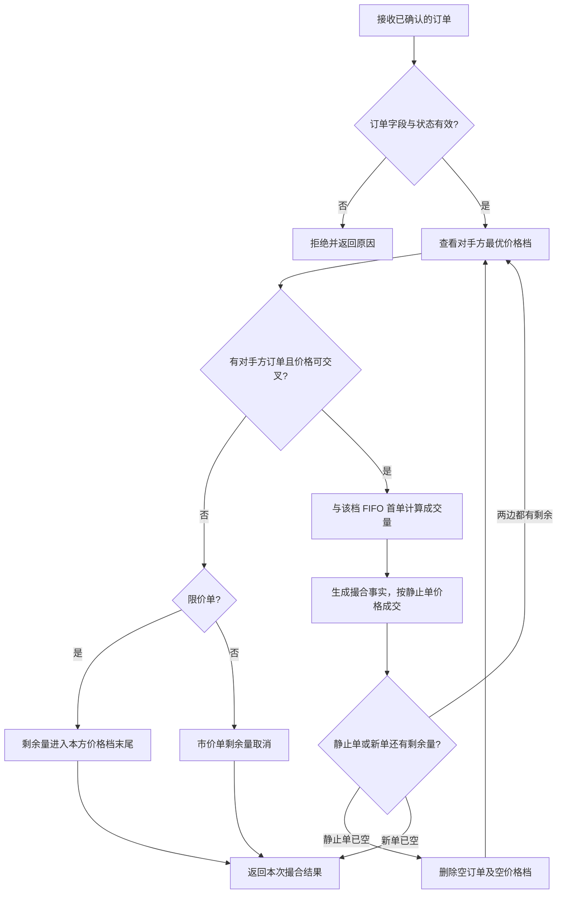

# OrderBook 设计：从需求到撮合规则

## 为什么这一课单独展开

当前 `ExchangeSimulator` 把一笔订单和一份 top-of-book 快照比较，最多返回一条成交。它能说明限价约束和可用量，却没有保存任何挂单，也没有在买卖订单之间撮合。

经典面试题里的 OrderBook 通常指一个**中央限价订单簿（CLOB）**：未成交的限价订单留在簿上；新订单到来后先和对手方的最优报价成交，剩余限价数量再排队。它包含数据结构、价格优先 / 时间优先、订单状态、并发顺序和失败边界，适合先做设计，再分小步编码。

本文只设计单证券、单进程、内存版。它是学习项目，不代表生产交易所实现。

## 1. 先把业务规则写成可验证要求

第一版采用以下规则：

1. 买单按价格从高到低排列；卖单按价格从低到高排列。
2. 同一价格的订单按进入簿的先后顺序排列（FIFO）。
3. 新买单仅在 `buyLimit >= bestAsk` 时与卖盘交叉；新卖单仅在 `sellLimit <= bestBid` 时与买盘交叉。
4. 双方成交价采用**簿上静止订单的价格**，不采用新到订单的限价。
5. 每笔成交量为新单剩余量和静止单剩余量中的较小值；只要一方归零就继续检查下一单。
6. 限价单剩余数量进入本方价格档并获得新的时间优先级。
7. 市价单消耗对手方现有流动性；没有可成交数量的剩余部分取消，不进入订单簿。
8. 只有已确认且未终结的订单可进入撮合。订单簿拒绝不合法状态或证券代码不一致的输入。
9. 订单簿生成成交事实，但不直接改写领域 `Order` 或 `Position`；上层应用成交并持久化状态。

第一版仅支持当前领域模型提供的 MARKET / LIMIT 和 DAY。DAY 的交易日历与收盘到期处理不在本设计范围内。

## 2. 用一个例子推演价格 / 时间优先

初始簿：

| 卖盘价格 | 静止卖单数量 |
| ---: | ---: |
| 10.50 | 4 |
| 10.60 | 3 |

买入限价单：数量 9、限价 10.60。

处理过程：

1. 10.60 ≥ 最优卖价 10.50：成交 4，成交价 10.50，静止卖单清空。
2. 继续看新的最优卖价 10.60：仍满足限价，成交 3，成交价 10.60，静止卖单清空。
3. 卖盘为空，买单还剩 2；它是限价单，所以剩余 2 进入买盘 10.60 价格档末尾。

结果：产生两笔撮合（每笔撮合有买卖双方），买单部分成交 7，剩余 2 挂在簿上。买方成交均价由领域订单根据实际成交计算：`(4 × 10.50 + 3 × 10.60) / 7`。

如果第二个静止卖单先于另一个 10.60 的卖单进入簿，它先获得该档成交机会。价格优先决定先选哪个价格档，FIFO 决定同档内先处理哪个订单。

## 3. 建议的数据结构

每个证券一个 `OrderBook`，包含买盘、卖盘和开放订单索引：

```text
OrderBook(symbol)
├── bids: TreeMap<Price, PriceLevel> 最高价优先
├── asks: TreeMap<Price, PriceLevel> 最低价优先
└── openOrders: Map<OrderId, RestingOrderRef>

PriceLevel
└── LinkedHashMap<OrderId, RestingOrder> 维持 FIFO，按 ID 可直接删除
```

- `TreeMap` 让最优价格可直接取出，新增 / 删除价格档为 `O(log P)`，`P` 是不同价格档数量。
- 同档 `LinkedHashMap` 保留插入顺序，按订单 ID 取消可在平均 `O(1)` 删除。
- `openOrders` 将订单 ID 指向其价格档和订单，避免取消时遍历全簿。
- `BigDecimal` 的价格档比较使用自然比较（`compareTo`），不要依靠 `equals` 的 scale 相等规则；例如 `10.5` 与 `10.50` 应属于同一档。
- 只把有剩余量的限价单放入 `PriceLevel`。市场单绝不休眠在簿上。

如果未来需要更低延迟，可比较手写双向链表和价格档堆 / 平衡树；第一版先选清楚、容易证明 FIFO 的结构，并测量后再优化。

## 4. 撮合流程



在概念设计里把“决定撮合结果”和“应用订单 / 持仓状态变更”分开。后续若加入故障安全，可进一步做成先生成撮合计划，再在一个明确的提交边界应用；不要在本阶段假定多对象写入天然原子。

## 5. API 与结果模型的设计选择

不要让 `OrderBook` 只返回一条 `Execution`。一笔 incoming 订单可能与多个静止单成交；每一笔交易还涉及买卖双方。建议区分：

- **`Trade` / `Match`**：一笔撮合的事实，含唯一 trade ID、买方订单 ID、卖方订单 ID、成交量、成交价和时间。
- **每单成交回报**：由上层把一笔 `Trade` 转成买方、卖方各一条 execution/update（或使用明确关联同一 trade ID 的模型）。现有 `Execution` 只有一个 `orderId`，表达不了交易对手及一笔撮合的双边关系。
- **`MatchResult`**：本次输入订单产生的撮合列表、剩余量、是否挂簿 / 是否取消剩余量。避免只靠订单可变状态猜测撮合结果。

建议接口草案：

```java
MatchResult submit(Order acceptedOrder, Instant acceptedAt);
CancelResult cancel(String orderId);
```

`submit` 输入应是已确认、订单簿允许处理的订单；它更新簿内 resting quantity，并返回 immutable match 结果。持久化与领域聚合更新由其上层负责。`cancel` 删除还在簿上的剩余数量；如果订单已经完全成交或不在簿上，返回明确的失败原因。

是否由 OrderBook 修改传入的 `Order` 是重要设计决策。本项目建议**不直接修改**：先返回撮合结果，由应用服务更新买卖双方的领域状态。这样边界容易学习，但必须明确异常时簿状态与领域状态尚未有事务保护，属于后续可靠性阶段。

## 6. 先拆测试，再写算法

按以下顺序把规则变成例子，每个小任务单独编译并跑 UT：

1. **单边报价与最优价**：多个买 / 卖价格档，检查 best bid / ask 排列。
2. **不交叉的限价单**：新单不成交，剩余量进入正确价格档末尾。
3. **单档成交**：交叉后按静止单价格成交，数量取较小值。
4. **跨多个价格档**：新单继续扫下一档；根据静止单价格产生多笔交易。
5. **同价 FIFO**：先进入的静止订单先成交，部分成交后继续保持原优先级。
6. **市价单**：有流动性则扫档；盘口用尽后取消剩余量，绝不挂簿。
7. **部分成交与双边账本**：静止单和 incoming 单的 leaves 数量都正确；结果能对应到两个订单。
8. **取消**：订单索引可删除目标剩余量，空价格档消失，其他订单次序不变。
9. **输入边界**：错误证券、未确认订单、终态订单、非正价格 / 数量和重复订单 ID 得到明确结果。
10. **簿不变量**：不存在空价格档；一个 resting order 只存在一处且索引一致；簿上的剩余量为正；静止买卖簿不交叉。

核心数量守恒：`原始数量 = 累计成交量 + 当前剩余量 + 已取消量`。价格不变量：每笔成交的成交价等于被动静止单价格，并且不能违反任一限价。

## 7. 并发、路由与 GigaSpaces 的后续关系

第一版单证券订单簿应有一个串行化的输入顺序：同一订单簿的 `submit` / `cancel` 不能并发改变 FIFO 次序。先用单线程调用实现确定性规则；不要在每个方法里随意加 `synchronized` 就声称解决了分布式并发。

之后可把证券映射到一个串行处理单元或分区，使同一个 symbol 的盘口和输入事件共置。这样同一证券的撮合顺序较容易保证，但按账户放置的资金 / 风险状态可能在另一个分区，跨证券账户限额仍需要单独设计。路由策略要以查询与更新工作负载及实测数据决定。

## 8. 明确暂不覆盖

- 行情快照的重复流动性消耗与连续行情接入
- 真实撮合簿之外的交易所路由、暗池、冰山 / 隐藏量、停牌和价格保护
- 多证券篮子、衍生品多腿、撮合优先级变种
- 撤单与成交并发竞态、改单优先级、DAY 收盘和交易日历
- 持久化、崩溃恢复、复制、审计和 Exactly-once 声明
- 微秒级性能优化与网络协议

## 9. 推荐的编码顺序

1. 增加 `Trade` 与 `MatchResult`，确认订单双边结果如何回到领域模型。
2. 实现纯内存、单证券 `OrderBook` 数据结构和 best bid / ask 查询。
3. 加限价单排队与价格 / FIFO 撮合；用上面的逐步测试守住不变量。
4. 加市价单扫描和剩余取消；再加按 ID 取消。
5. 写一段确定性的演示，展示多档成交和部分挂单。
6. 再讨论每 symbol 串行处理、GigaSpaces 路由和失败恢复。

第一版单证券 OrderBook 已按以上范围实现，源码与 UT 在 `exchange-simulator`。后续每个演进小步仍应跑 Java 25 编译及相关 UT；并发、持久化和 GigaSpaces 分区不属于当前实现。
