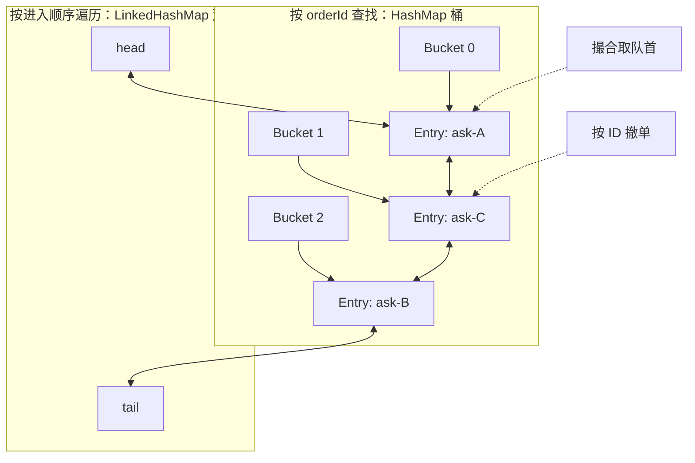

# OrderBook 撮合流程：进来一张单之后发生什么

## 一句话理解

OrderBook 保存当前还没成交的买单和卖单。新订单进来后，它先看**对手盘最优价**：买单看最低卖价，卖单看最高买价。如果价格满足成交条件，就和该价位队首订单成交；成交后再看新的队首。对手盘不能再成交时，限价单的剩余量挂到本方，市价单的剩余量取消。

它可以看作一个**有状态的撮合器**：订单簿是状态，`submit` 和 `cancel` 是改变状态的操作。它也像“两个 heap 取堆顶再比较”的算法，不过本项目代码实际用 `TreeMap` 管价格档，不是 heap。

## 买单进入时的完整例子

当前卖盘有：

| 卖价 | 数量 | 进入顺序 |
| ---: | ---: | --- |
| 10.50 | 4 | 第一张 |
| 10.60 | 3 | 第二张 |
| 10.60 | 5 | 第三张 |

现在进来一张 BUY LIMIT：数量 `9`、限价 `10.60`。

1. 买单愿意最多付 `10.60`，先看最低卖价 `10.50`。`10.60 >= 10.50`，可以成交。
2. 取新买单剩余量 `9` 和第一张卖单剩余量 `4` 的较小值，成交 `4 @ 10.50`。卖盘第一档被清空。
3. 再看此刻的最低卖价。下一档是 `10.60`，仍满足买单限价；与该价位 FIFO 队首成交 `3 @ 10.60`。
4. 再看 `10.60` 价位的下一张卖单。买单还剩 `2`，于是成交 `2 @ 10.60`。此时买单数量用完，撮合结束；该卖单还剩 `3`。

最终有三笔 `Trade`：`4 @ 10.50`、`3 @ 10.60`、`2 @ 10.60`。买单全部成交；卖盘 10.60 档还剩数量 6。注意买方的限价是最高可接受价，不是成交价；成交价取簿上静止订单的价格。

如果同一张买单数量只有 `6`，它会分别成交 `4 @ 10.50` 和 `2 @ 10.60`，之后买单全部成交。第一张 10.60 卖单还剩 `1`，仍排在该价格档队首；后一张卖单仍剩 `5`。

## 每次撮合都只做这几步

```text
remaining = incoming order 的剩余量

while remaining > 0 且对手盘不为空：
    resting = 对手盘的最优价格档里的 FIFO 首单
    如果 incoming 的价格不能和 resting 的价格成交：停止

    fill = min(remaining, resting 的剩余量)
    生成一笔 Trade，价格取 resting 的价格
    同时扣减双方在订单簿里的可用剩余量
    如果 resting 归零：从价格档移除；价格档为空时再移除该档

如果 incoming 还有剩余量：
    LIMIT → 加入本方价格档队尾
    MARKET → 取消剩余量
```

这里的 `while` 很关键：一次新单可以扫过多个价格档、成交多个静止订单；不是只和当前 top-of-book 做一次比较。

## 买盘和卖盘怎么选“最好”

```text
买盘 bids：价格高的更优 → 最高买价在前
卖盘 asks：价格低的更优 → 最低卖价在前

同一价格档：先进入订单簿的先成交（FIFO）
```

对于新买单：只检查卖盘；市价买单可与当前卖盘成交，限价买单要满足 `buyLimit >= bestAsk`。对于新卖单：只检查买盘；限价卖单要满足 `sellLimit <= bestBid`。同价 FIFO 只在选定价格档之后起作用，不能让较早进入的差价订单越过更优价格档。

## 这个项目代码里的对应关系

| 处理步骤 | `OrderBook` 中的实现 |
| --- | --- |
| 验证证券、状态并取得新单剩余量 | `submit(...)` 开头 |
| 选择对手盘 | `oppositeBook(...)` |
| 取最优价格档 | `TreeMap.firstEntry()`；买单的 asks 升序，卖单的 bids 降序 |
| 检查是否能成交 | `canMatch(...)` |
| 取价位队首并计算成交量 | `LinkedHashMap` 的首个订单；`min(incoming, resting)` |
| 生成成交事实并扣减簿内 resting 数量 | `new Trade(...)` 与 `restingOrder.remainingQuantity` 更新 |
| 清理完全成交的静止单 | `removeRestingOrder(...)` |
| 挂入限价剩余量 / 取消市价剩余量 | `addRestingOrder(...)` 或写入 `cancelledQuantity` |

## “两个 heap”这个理解哪里对、哪里不同

算法直觉是对的：可以把 bids 想成**最大堆**、asks 想成**最小堆**，反复查看堆顶并比较价格。最优价在堆顶，同价订单还要有 FIFO 顺序。

本项目用了 `TreeMap<Price, PriceLevel>`，而不是 heap：它按价格组织整本订单簿，每个价格档里用 `LinkedHashMap` 保存 FIFO 队列；另有 `openOrders` 索引支持按订单 ID 撤单。普通 heap 对“取堆顶”很合适，但任意撤单要额外维护索引或采用延迟删除。当前选择优先让价格档、FIFO 和撤单路径容易读懂。

## 系统设计视角：复杂度和结构取舍

先定义符号：`N` 是簿上活动订单数，`P` 是不同价格档数，`K` 是一次新单实际触碰 / 成交的静止订单数，`E` 是本次撮合中被清空并移除的价格档数，`Qbest` 是最优价档里的订单数。通常 `P ≤ N`，且 `E ≤ K`。假设价格比较和哈希计算为常数时间；`HashMap` / `LinkedHashMap` 的 O(1) 是平均复杂度。

| 操作 | 当前结构 | 时间复杂度 | 说明 |
| --- | --- | --- | --- |
| 取最优价格档 | `TreeMap.firstEntry()` | `O(log P)` | 当前 Java `TreeMap` 沿树找到最左 / 最右节点 |
| 同价档追加一张单 | `LinkedHashMap.put` | 平均 `O(1)` | 保持 FIFO，新价格档本身还要插入 `TreeMap`，所以首次建档是 `O(log P)` |
| 按 ID 撤单 | `openOrders` + 价格档 map + `TreeMap` | `O(log P)` | 哈希索引平均 `O(1)`；若删掉该价位最后一单，还要从 `TreeMap` 移除价格档 |
| 处理一次新单 | 反复查看最优价并消费静止订单 | 最坏 `O((K + E + 1) log P)`，上界 `O((K + 1) log P)` | 当前循环每次都重新取 `firstEntry`；触碰 / 清空很多档时树操作会累加 |
| 查询 best bid / ask 的价格和档内总量 | `firstEntry` + 遍历最优价档 | `O(log P + Qbest)` | 目前 `bestPriceLevel(...)` 为计算总量而遍历该档；若档上有很多单，这不是纯 `O(log P)` |
| 内存 | 价格档树、订单 map、撤单索引、历史 ID 集合 | `O(N + P + H)` | `H` 是 `submittedOrderIds` 保留的历史订单 ID 数，会随进程运行时间持续增长 |

这张表也提示一个容易漏掉的设计点：如果行情接口频繁查询 top-of-book，可以把每档封装成 `PriceLevel`，维护 `totalQuantity` 和 `orderCount`，每次成交 / 撤单增量更新。这样 best bid / ask 的档内数量就不必遍历该档订单；但要额外保证聚合字段和队列数量一致。

### `TreeMap + LinkedHashMap`、`TreeMap + LinkedList` 与双 heap

| 方案 | 强项 | 代价 / 注意点 | 更适合的场景 |
| --- | --- | --- | --- |
| **当前：`TreeMap<Price, LinkedHashMap<OrderId, Order>>`** | 价格自然有序；每个价位内部保持 FIFO；按 ID 在价位内平均 `O(1)` 删除；结构容易逐步检查 | 树节点与哈希 / 链节点有额外对象和指针开销；取最优档为 `O(log P)`；本实现的 best 档总量查询会遍历档内订单 | 教学实现、需要清晰价格档 / FIFO / 按 ID 撤单的中等规模订单簿 |
| **`TreeMap + 自定义双向链表 + HashMap<OrderId, Node>`** | 链表队首撮合；持有节点引用时任意节点删除均为 `O(1)`；可精确控制节点内容和内存布局 | 单有 `LinkedList` 时按 ID 找单仍为 `O(N)`；Java 标准 `LinkedList` 不暴露内部节点，想通过 ID 索引做 O(1) 删除通常要自定义链表节点；还要维护 ID → 节点 / 价格档索引和空档清理，代码与不变量更多 | profile 数据证明确有收益后，想把撤单和撮合节点路径做到更可控的实现 |
| **买卖各一个 heap** | 看堆顶通常 `O(1)`；插入和弹出 `O(log N)`；实现最优价访问直观 | 同价 FIFO 要把价格与序号一起排序；任意撤单通常要 O(N) 搜索，或增加 heap 索引 / 延迟删除；延迟删除会留下过期节点并让堆顶清理复杂 | 以最优价和顺序弹出为主、取消少，或有成熟的 indexed-heap 实现 |

`LinkedHashMap` 本身已经把 hash 查找和双向插入顺序链结合起来，因此按 ID 移除时不必再线性扫描链表。这不等于它一定比自定义链表更快：它还维护哈希桶、链指针和对象；真实延迟 / GC 成本要在目标 JVM 与负载下测量。

### `LinkedHashMap` 的底层关系图

一个价格档里的 `LinkedHashMap<OrderId, RestingOrder>` 同时维护两种关系：



图里哈希桶的排列只是示意，实际 bucket 位置由 key 的 hash 决定，碰撞时一个桶可能挂多个 entry；它**不负责 FIFO**。FIFO 来自另一条全局双向链：新 entry 默认接到尾部，按 `values()` 遍历会从头到尾；按 ID 删除时先通过哈希结构找到 entry，再把它从双向链中摘掉。

在本项目里，`ask-A`、`ask-C`、`ask-B` 只是示意订单 ID。订单进入某个价格档后，`values().iterator().next()` 取双向链的头部订单；`LinkedHashMap.remove(orderId)` 则按 ID 定位并删除。该档完全空了，外层 `TreeMap` 再移除这个价格档。

如果用 heap，要定义同价 tie-breaker，例如 `(price, arrivalSequence)`。买盘以价格降序、序号升序比较，卖盘以价格升序、序号升序比较。若取消采用“延迟删除”，取消命令先标记订单无效，弹出堆顶时跳过已取消节点；必须监控并清理堆内陈旧节点，否则内存和最优价检查成本会慢慢增加。

### 面试时的设计流程

1. **问清操作**：需要最优 bid / ask、同价 FIFO、部分成交、按 ID 撤单、查询档位总量吗？哪些操作是热路径？
2. **写不变量**：价格优先；同价时间优先；成交不违反双方限价；成交量不超任一方 leaves；空档不留在簿内；静止买卖盘不能交叉。
3. **选索引组合**：价格结构负责最优档，档内队列负责 FIFO，ID 索引负责撤单。不同访问需求往往需要多个互补索引，而不是要求一个数据结构包办所有操作。
4. **算复杂度并指出真实热点**：不能只说 heap 的 peek 是 `O(1)`，还要说明撤单、档内总量查询、同价排队和更新索引的成本。
5. **定义顺序 owner**：一个 symbol 的 submit / cancel 必须串行决定先后；横向扩展通常按 symbol 分配撮合 owner，而不是让多个线程无协调地改同一簿。
6. **再谈优化**：先用确定性 UT 守住价格 / 数量 / FIFO 不变量，再 profile；只有测量显示树查找、对象分配或锁竞争是瓶颈时，才换 indexed heap、数组价格档或自定义链表。

在本项目中，`N` 是单证券活动挂单数。`submittedOrderIds` 是防止同一订单 ID 再次提交的进程内集合；它当前按所有历史提交保留 ID，所以真实长时间运行时需要有界或持久化的去重策略，不能忽略这部分内存增长。

## OrderBook 不负责什么

- `OrderBook` 返回 `Trade` 和 `MatchResult`，并维护簿上的静止订单剩余量；它**不更新领域 `Order` 的累计成交量、均价和状态**。
- `OrderCommandProcessor` 接到成交结果后，才分别对买卖订单调用 `applyExecution(...)` 并返回双边 `ExecutionReport`。
- 这里是单线程、单 JVM 的教学实现。并发命令顺序、崩溃恢复、撮合状态与回报的原子性都还没有解决。

建议接着读：[OrderBook 设计说明](order-book-design.zh-CN.md)看规则、数据结构和测试拆分；再读[Stage 4 订单事件说明](stage4-order-events.zh-CN.md)看撮合结果如何变成订单事件。
