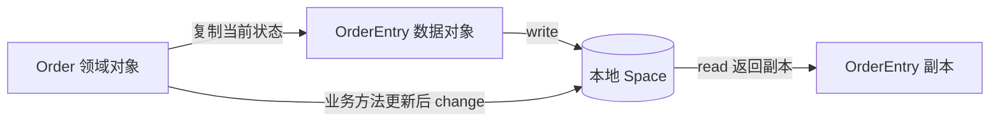

# 阶段 2：一笔订单的 Space 读写

这一步使用 Java 25 和 GigaSpaces 18.0.0，在当前 JVM 内启动一个内存 Space。退出程序后数据消失；本阶段的实验使用一个写入者。

## 先运行

在项目根目录执行：

```powershell
java -version
mvn -pl gigaspaces-grid -am install
mvn -pl gigaspaces-grid exec:exec
```

第一条 Maven 命令编译领域和 Grid 模块、运行测试，并把项目依赖安装到本机 Maven 仓库。第二条命令启动 `SpaceLesson`。不要给第二条命令加 `-am`，父项目没有这个演示入口。

GigaSpaces 的依赖来自官方仓库 `https://maven-repository.openspaces.org`。如果个人 Maven 配置的镜像使用 `mirrorOf=*`，它会连这个仓库也一起拦截；应将镜像范围改为 `central`，或者排除 `org.openspaces`。如果报 Maven 缓存目录不可写，应配置一个可写的本地仓库。

如果启动时报许可缺失或过期，需要从 GigaSpaces 获取适用于当前版本的合法评估或正式许可，并在本地设置 `GS_LICENSE`。本项目不包含许可密钥；`gs-license.txt`、环境配置和日志已被 Git 忽略。不要把密钥写进 POM、源码或提交记录。项目 MIT License 适用于本项目代码，依赖本身遵循其各自许可。

## 按这条路径读代码

1. `SpaceLesson` 创建领域订单，再调用 `repository.save(order)`。
2. `OrderEntry.from(order)` 把订单状态复制成 Space 数据对象。它采用 Lombok getter/setter 和无参构造器。
3. `LocalOrderSpace` 用 `EmbeddedSpaceConfigurer` 创建 Space；`GigaSpace` 是应用操作它的接口。
4. `OrderSpaceRepository` 直接展示 `write`、`read`、SQL 条件查询、`change` 和 `take`。



`Order` 负责状态规则；`OrderEntry` 负责框架存取。当前仓库读取的是数据快照，还没有实现从快照恢复完整领域对象：订单已应用成交 ID 的集合也尚未存入 Space。因此本阶段不用于订单恢复或多个写入者并发更新。

## 本次要理解的四个操作

| 操作 | 在这个项目中的行为 |
| --- | --- |
| `write` | 默认同 ID 不存在时新增、存在时更新，不会因为重复写同一个订单而多出一条记录 |
| `read` | 读取副本，Space 中的记录仍保留；修改返回对象不会自动保存 |
| `change` | 一次调用更新已存订单的状态、成交数量和均价；状态先由领域对象计算 |
| `take` | 读取并移除记录；不等同于业务上的撤单。撤单应先由 `Order.cancel()` 表达 |

`@SpaceId` 标记订单身份，相当于对象的主键。`@SpaceRouting` 暂选 `orderId`；当前只有一个 Space 实例，尚未验证分区策略。`@SpaceIndex` 给 `symbol` 建索引，方便演示条件查询。

## 演示输出

除框架日志外，程序会打印类似结果：

```text
write + read: order-001, status=NEW, filled=0/100, averagePrice=0
write same ID: order-001, status=ACKNOWLEDGED, filled=0/100, averagePrice=0
change: order-001, status=PARTIALLY_FILLED, filled=40/100, averagePrice=10.50
query DEMO: 1 order(s)
take: order-001, status=PARTIALLY_FILLED, filled=40/100, averagePrice=10.50
read after take: Optional.empty
```

## 故障场景和自检问题

故障场景：对未写入的订单调用 `updateState`。仓库应报告订单不存在，并且不会凭空插入记录；测试覆盖了这个行为。

其他测试覆盖：完整数据快照、读副本的隔离、同 ID 更新、成交状态更新、symbol 查询，以及 `take` 后查询为空。

自检问题：为什么读取 `OrderEntry` 后直接 `setStatus(...)` 不会改变 Space 中的数据？`write` 同 ID 和 `change` 的更新范围有什么区别？为什么仅有一次 `change` 并不能保证两个写入者的整个“读取—计算—更新”流程正确？

## 官方资料

- [18.0 支持平台](https://docs.gigaspaces.com/18.0/rn/supported-platforms.html)：Java 25 要求。
- [Maven 配置](https://docs.gigaspaces.com/18.0/started/installation-maven-overview.html)：官方依赖仓库和 `xap-openspaces`。
- [Space 基础操作](https://docs.gigaspaces.com/latest/dev-java/the-space-operations.html)。
- [许可设置](https://docs.gigaspaces.com/latest/started/license-setup-service-grid.html)。
