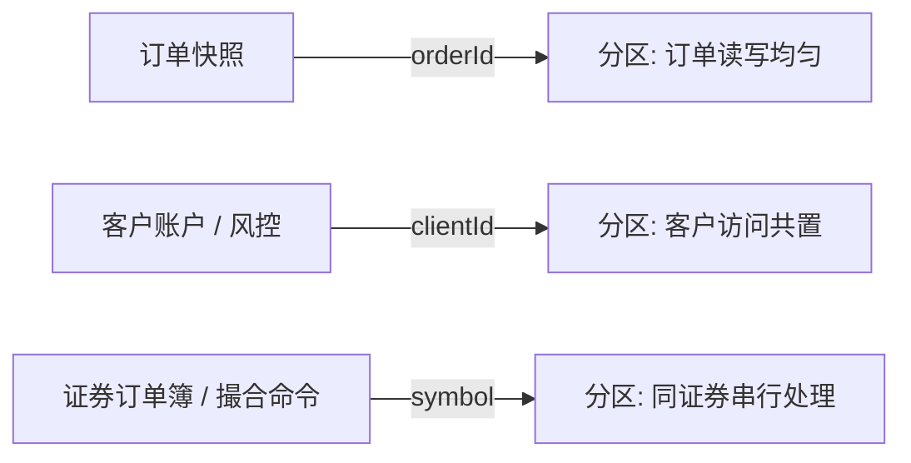

# Stage 3：分区路由与数据亲和性

## 目标

理解 routing key 如何决定对象所在的 partition，以及“把相关数据放一起”与“把数据均匀摊开”之间的取舍。本阶段先用确定性模型比较路由策略，不把模拟结果误当成 GigaSpaces 集群的吞吐或延迟数据。

## 运行实验

从项目根目录运行：

```powershell
mvn -pl gigaspaces-grid -am test
mvn -pl gigaspaces-grid exec:exec '-Dlesson.mainClass=dev.tradingexecutionlab.grid.RoutingExperimentLesson'
```

实验固定生成 10,000 个订单、500 个客户、50 个证券，并映射到 16 个逻辑分区。客户与证券通过固定种子的伪随机数独立抽取，避免人为让每个客户只交易一个证券。订单、客户和证券编号是合成值。实验代码在 `gigaspaces-grid` 的 `PartitionRouter`、`RoutingExperiment` 和 `RoutingExperimentLesson`。

分区计算按 GigaSpaces 文档描述的 hash 路由思路实现：对 routing value 的 hash 取安全绝对值，再对分区数取模。若生产使用其他类型、复合 routing 或不同版本，需通过真实 Space 再确认行为。

## 如何读结果

- `counts`：每个逻辑分区上的订单条数。
- `max/mean`：最大分区订单数除以平均分区订单数；越接近 1，合成订单分布越均匀。
- `clientPairsLocal`：所有“同一客户订单对”中，两个订单落在同一分区的比例。
- `symbolPairsLocal`：所有“同一证券订单对”中，两个订单落在同一分区的比例。

| routing key | 分布 / 亲和性 | 适合的访问模式 | 主要代价 |
| --- | --- | --- | --- |
| `orderId` | 唯一键通常分布较均匀；客户和证券相关订单通常分散 | 按单号读写一张订单 | 客户级风控、证券级订单簿可能跨分区 |
| `clientId` | 同一客户订单完全共置；客户数较少或流量不均会造成热点 | 客户订单、账户和客户级风险状态一起处理 | 单个热门客户压到一个分区；证券订单簿仍分散 |
| `symbol` | 同一证券订单完全共置；证券交易活跃度不同会造成热点 | 单证券订单簿与该证券订单在本地处理 | 热门证券形成热点；一个客户跨证券访问可能跨分区 |

## 对本项目的决策

单个 `OrderEntry` 通过 `orderId` 路由，适合按内部订单 ID 精确定位快照；这不代表它适合订单簿。单证券 `OrderBook` 要求同一证券的撮合状态由一个串行 owner 管理，未来可以把订单簿与撮合命令按 `symbol` 共置。客户账户与风控状态若按客户访问，则需要考虑 `clientId` 共置，或接受跨分区访问。

实验中的 `max/mean` 与本地性结果由 `RoutingExperimentLesson` 实际打印，不在文档中虚构延迟或吞吐。

当前 Java 25 / GigaSpaces 风格 hash 模型的示例输出：

| routing key | max/mean | clientPairsLocal | symbolPairsLocal | 备注 |
| --- | ---: | ---: | ---: | --- |
| `orderId` | 1.10 | 6.1% | 6.3% | 订单均匀分散，两种业务聚合都很少共置 |
| `clientId` | 1.54 | 100.0% | 6.7% | 客户订单共置，但有分区倾斜 |
| `symbol` | 1.66 | 8.4% | 100.0% | 证券订单共置；本样本有两个空分区，说明 key 分布 / hash 映射也要检查 |

这些数值来自固定种子的合成数据和当前字符串 key。数据规模、key 格式或 GigaSpaces 版本变化后应重新运行；它们不是普适的 hash 质量结论。



## PU 与 partition

Partition 是数据分片单位；PU（Processing Unit）是部署业务代码和服务的运行单元。集群拓扑会让 PU 实例承载 partition / backup，并在本地处理与其数据亲和的工作。二者相关但不是同一个概念：partition 不是线程，PU 也不等于单个订单。实际实例数、分区数、副本数要结合部署拓扑决定。

## 当前实验边界

这里验证了路由函数、分布倾斜指标和按访问键共置的定性差异，但没有启动多个 Space partition，也没有测网络跳数、集群延迟、备份复制、容量或故障切换。要做集群性能决策，还需在至少两个真实 partition 上运行同一工作负载，并记录查询路由、跨分区访问、热点和 p50/p99 延迟。

## 自测

1. 为什么单订单查询用 `orderId` 路由可以直接定位，但客户级风控不一定本地？
2. 如果 `symbol` 路由下某个证券占 40% 流量，增加 partition 数是否一定能缓解热点？
3. 哪些数据必须和撮合命令在同一个串行 owner 上？哪些可接受远程访问？

## 面试表达

“我会按访问事务选择 routing key，而不只追求均匀哈希。订单快照按 orderId 定位；撮合状态按 symbol 共置以维护单证券顺序；客户风险状态按 clientId 共置。三者不能同时完全本地，因此要根据主要工作负载权衡热点与跨分区成本，并用真实集群压测确认。”
