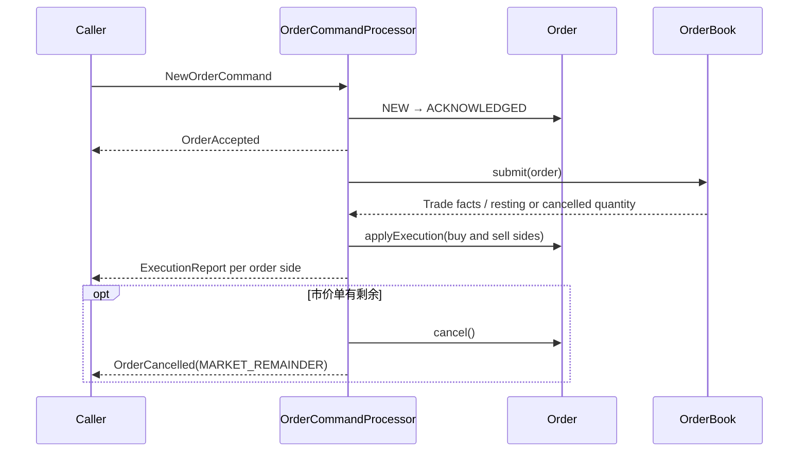

# Stage 4：订单命令与事件处理

## 目标

把已经实现的单证券 `OrderBook` 接入一个可读的同步处理流程：接收新单 / 撤单命令，改变订单状态，并返回确认、拒绝、成交回报或撤单结果。这里的事件是方法返回的不可变 Java 值；本阶段尚未使用 GigaSpaces Notify、Polling Container 或消息中间件。

## 运行与验证

从项目根目录运行：

```powershell
mvn -pl exchange-simulator -am test
mvn -pl exchange-simulator exec:java
```

核心实现：`OrderCommandProcessor`、`OrderCommand`、`OrderEvent` 及其 record 类型。UT 在 `OrderCommandProcessorTest`，撮合规则仍由 `OrderBookTest` 覆盖。

## 处理流程



### 新单

1. 只接受状态为 `NEW` 的订单，并拒绝本处理器已经接收过的重复 `orderId`。
2. 先把订单迁移到 `ACKNOWLEDGED`，登记到本地映射，并返回 `OrderAccepted`。
3. 将订单提交到对应证券的 `OrderBook`。限价剩余量挂入簿中；市价剩余量不会挂簿。
4. 每笔撮合 `Trade` 会产生买方、卖方各一条 `ExecutionReport`，分别调用对应 `Order.applyExecution`。
5. 市价单成交后的剩余量转为 `CANCELLED`，返回 `OrderCancelled`，原因是 `MARKET_REMAINDER`。

事件顺序固定为：`OrderAccepted`、每笔成交对应的买方 / 卖方回报、必要时的剩余量撤销。每笔 trade 的双边回报按 BUY 再 SELL 排列，便于测试复现。

### 撤单

撤单请求是 `CancelOrderCommand`，成功才会返回 `OrderCancelled` 并修改订单状态。未知订单、已终结订单或没有挂单剩余量会返回 `CancelRejected`。这保留了“请求撤单”与“撤单成功”之间的区别。

## 当前简化及下一步

- 单线程、单 JVM 内存处理；没有并发锁、持久化、重启恢复、事件重放或跨节点顺序保证。
- `orderId` 去重只在当前处理器进程存活期间有效；处理器重启后不保留。
- 事件对象还不是 FIX `ExecutionReport (35=8)`。FIX 字段映射、`ClOrdID` / `OrigClOrdID`、序号、重发和终态 `LeavesQty` 规则留给 Stage 9。
- 本阶段不做风控、DAY 到期、改单、成交撤销 / 更正、账户持仓或 outbox。
- 如果 book 已修改而回报生成失败，目前没有事务回滚；生产系统需设计事务 / 日志、重试和恢复边界。
- `OrderCommandProcessor` 是简单教学代码；不要把它作为生产订单管理系统或真实交易网关。

## 验收场景

| 输入 | 预期 |
| --- | --- |
| 新建不交叉限价单 | 接收事件，订单保持 `ACKNOWLEDGED` 并挂簿 |
| 新单打到一张或多张挂单 | 接收后生成每笔成交的双边回报，双方累计成交量和均价更新 |
| 市价单成交不足 | 可成交部分有回报，剩余部分取消，不进入订单簿 |
| 撤销挂单 | `OrderCancelled`，订单状态为 `CANCELLED` |
| 撤销未知 / 已完成订单 | `CancelRejected`，原订单不变 |
| 重复内部 `orderId` | `OrderRejected`，已受理订单不被覆盖 |

## 自测

1. 为什么确认事件出现在成交回报之前？如果异步事件消费者乱序会发生什么？
2. 一笔 trade 为什么要对应两个 execution report？
3. “处理器返回了两个事件”是否代表两个事件已经可靠送达？
4. 发生进程崩溃后，怎样避免已修改的订单簿与未发送的回报不一致？

## 面试表达

“我把命令与事实事件分开。新单经过校验后先确认，再由单证券订单簿撮合；一个 trade 是撮合事实，买卖双方分别更新订单并产生执行回报。撤单请求只有从订单簿移除剩余量后才确认。当前代码是单线程内存教学模型，接下来要为并发顺序、幂等和崩溃恢复引入可持久的命令 / 事件边界。”
